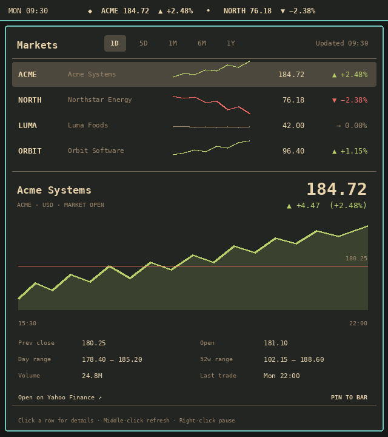
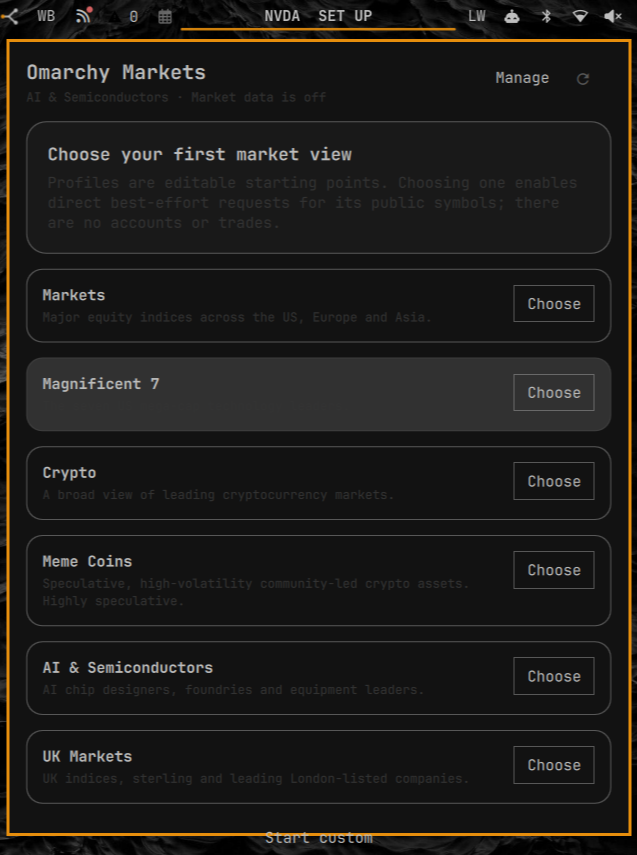

# Usage and development guide


Stocks, indices and crypto in your Omarchy bar. Follow a scrolling watchlist,
open the panel to compare quotes, and inspect five price-history ranges. Start
with one of six editable profiles or build your own watchlist.

No account or API key. Market data stays off until you choose a profile or
enable a custom watchlist. Quotes come from Yahoo Finance’s unofficial endpoint
and may be delayed. This is a market glance, with no trading or portfolio tools.



These are actual screen captures of Omarchy Markets 0.3.2 on Omarchy, taken on
12 September 2026. The main panel shows public Yahoo Finance data; the profile
chooser was captured with market data paused. Capture provenance and remaining
acceptance checks are recorded in [`docs/acceptance.md`](docs/acceptance.md).

## Install

Requires **Omarchy 4 / Quattro** with shell-plugin support and **Python 3.10+**
at `/usr/bin/python3`. The helper uses the standard library only.

Install the public repository and enable the widget:

```bash
omarchy plugin add https://github.com/tcballard/omarchy-markets.git --enable
```

Open the widget and choose a profile to begin. Installation follows the current
`main` branch; the release tag records an immutable source version. To update:

```bash
omarchy plugin update io.github.tcballard.omarchy-markets
```

If an older installation stays on **Loading**, update to include the public
plugin API fix shipped in **v0.3.3**. For local development, pass the checkout
path to `omarchy plugin add` instead of the repository URL.

The widget defaults to the right side of the bar. If needed:

```bash
omarchy bar put io.github.tcballard.omarchy-markets --section right
```

### Upgrade from Market Watch 0.1

The product name and community plugin ID changed in 0.2, so Omarchy treats this
as a new plugin rather than an in-place update. Remove the old entry, install
Omarchy Markets, and choose a profile or rebuild the watchlist in the panel:

```bash
omarchy plugin remove io.github.tcballard.market-watch
omarchy plugin add https://github.com/tcballard/omarchy-markets.git --enable
```

The old plugin had no persistent market-data cache. Its inline settings are not
silently copied into the new consent-gated configuration.

## Start with a profile

The first open shows a profile chooser. Nothing is fetched until you choose a
profile or save a custom watchlist. Every profile is only an editable starting
point: you can add, remove, reorder, or pin instruments afterwards.

| Profile | What it follows | Primary |
| --- | --- | --- |
| Markets | Major global indices and volatility | `^GSPC` |
| Magnificent 7 | Seven US mega-cap technology companies | `NVDA` |
| Crypto | Established large-cap crypto assets in USD | `BTC-USD` |
| Meme Coins | Highly speculative, internet-native crypto assets | `DOGE-USD` |
| AI & Semiconductors | Chip designers, foundries, equipment, and memory | `NVDA` |
| UK Markets | UK benchmarks, sterling, and leading London listings | `^FTSE` |



The Meme Coins profile is deliberately labelled as speculative. Profile
membership can drift, so it should never be treated as an endorsement.

## What it does

- Scrolls the watchlist across a bounded horizontal ticker by default, with a
  persistent pause control and a zero-speed motion-off setting; vertical bars
  use the compact pinned-symbol presentation.
- Keeps the everyday panel dense and scan-first: ranges at the top, compact
  quote rows in the middle, and one flat selected-instrument detail below.
- Keeps Profiles in onboarding and management, so they accelerate setup without
  turning the normal market view into a configuration dashboard.
- Inspects a row without silently changing the bar; pinning the selected symbol
  is a separate action.
- Switches between 1D, 5D, 1M, 6M, and 1Y history for the selected instrument.
- Shows previous close, open, day range, 52-week range, volume, and the selected
  range's return when the provider supplies them.
- Shares one poller across monitors and stores a bounded last-good cache so a
  temporary outage does not turn known values into zeroes.
- Uses symbols, arrows, signs, and text as well as colour for direction.

## Use

| Input | Action |
| --- | --- |
| Left-click the bar | Open or close Omarchy Markets |
| Middle-click the bar | Refresh now |
| Right-click the ticker | Pause or resume ticker motion |
| Click a watchlist row | Inspect that instrument |
| Click **Pin to bar** | Make the inspected instrument primary |
| Click **Manage** | Add, remove, or reorder the watchlist |
| Up/Down or J/K | Move through profiles, manager rows, or the watchlist |
| Left/Right | Change the selected chart range |
| Enter/Space | Choose the highlighted profile, focus custom entry, or inspect |
| P | Pin the highlighted instrument to the bar |
| R | Refresh now |
| O | Open the highlighted quote on Yahoo Finance |
| M | Enter or leave the watchlist manager |
| A (manager) | Focus the add-symbol field |
| `[` / `]` (manager) | Move the highlighted symbol up or down |
| X / B / C / T (manager) | Remove / change bar mode / data toggle / ticker pause |
| 1–6 / C (setup) | Choose a numbered profile / start custom |
| Escape | Leave management or close the panel |
| Tab/Shift-Tab | Switch to the neighboring bar panel; Tab leaves symbol entry |

Use the panel's profile and watchlist controls for normal configuration. Omarchy
also exposes the manifest settings as an administrative fallback:

| Setting | Default | Notes |
| --- | --- | --- |
| `dataEnabled` | `false` | Strict consent gate; no market request before setup |
| `profile` | empty | Profile ID; cleared after the first manual watchlist edit |
| `symbols` | empty | Ordered, deduplicated, comma-separated list; maximum 12 |
| `primarySymbol` | empty | Pinned bar symbol; must appear in the watchlist |
| `selectedRange` | `1d` | `1d`, `5d`, `1mo`, `6mo`, or `1y` |
| `barMode` | `ticker` | `single` or horizontal-only `ticker` |
| `refreshIntervalSec` | `900` | Clamped to 300–3600 seconds |
| `showPrice` | `true` | Keep symbol and movement while hiding price |
| `tickerWidth` | `220` | Horizontal ticker viewport, 160–640 px |
| `tickerSpeed` | `24` | Scroll speed; zero disables motion |
| `tickerPaused` | `false` | Persistent manual pause state |

Example administrative configuration:

```bash
omarchy bar set io.github.tcballard.omarchy-markets dataEnabled true --json
omarchy bar set io.github.tcballard.omarchy-markets symbols "AAPL, MSFT, NVDA, ^GSPC"
omarchy bar set io.github.tcballard.omarchy-markets primarySymbol AAPL
```

Use `--json` for booleans and numbers so Omarchy preserves their types.

## Data, cache, and privacy

The bundled standard-library Python helper requests public chart data directly
from Yahoo Finance's unofficial endpoint:

```text
https://query1.finance.yahoo.com/v8/finance/chart/<symbol>
```

Requests contain the configured public symbols plus the selected history range.
There is no API key, account, telemetry, hosted proxy, plugin daemon, or
currency conversion. Values remain in each instrument's native Yahoo quote
currency; London `.L` equities, for example, are commonly reported in pence.

Yahoo's endpoint is undocumented and best effort. It has no published uptime or
rate-limit guarantee, can return delayed or indicative data, and may change or
reject requests. Scheduled refreshes are clamped to at least five minutes;
manual refreshes have a cooldown; requests, symbols, history points, and response
sizes are bounded. Do not use Omarchy Markets as the sole source for a financial
decision.

Last-good watchlist and selected-history responses use separate atomic,
owner-only cache files. Each history key gets its own bounded file so
superseded helpers cannot overwrite another instrument or range:

```text
${XDG_CACHE_HOME}/omarchy-markets/quotes-v1.json
${XDG_CACHE_HOME}/omarchy-markets/history/<SYMBOL>-<RANGE>-v1.json
```

If `XDG_CACHE_HOME` is unset or not absolute, the fallback is
`~/.cache/omarchy-markets/`. Cached values are explicitly labelled stale when
used after a failed refresh. Delete the plugin's cache directory at any time to
clear every bounded entry.

Provider context: [Yahoo Finance data-use guidance](https://help.yahoo.com/kb/finance/SLN2310.html)
and the [yfinance project notice](https://github.com/ranaroussi/yfinance#legal-stuff).

## Requirements and trust boundary

- Omarchy 4 with Quattro shell-plugin support.
- Python 3.10 or newer at `/usr/bin/python3`; only the standard library is used.
- Network access to `query1.finance.yahoo.com` after explicit setup.

Omarchy plugins execute as unsandboxed user code inside the long-running shell.
Omarchy Markets runs with your normal user permissions. It does not request
elevation, install packages, start a system service, read credentials, evaluate
downloaded code, or interpolate a symbol into a shell command. Symbols are allowlisted and percent-encoded before the helper
uses the fixed HTTPS host. See [`SECURITY.md`](SECURITY.md) for the full boundary
and reporting guidance.

## Release and marketplace status

[Releases](https://github.com/tcballard/omarchy-markets/releases) record tagged
source versions and checksums. See the [changelog](CHANGELOG.md) for changes.

The plugin is [available in the marketplace](https://plugins.omarchy.org/plugin.html?id=io.github.tcballard.omarchy-markets).
The last maintainer-reviewed snapshot is
[`4a667da`](https://github.com/tcballard/omarchy-markets/commit/4a667dadfce52251ac4d897ac3f10fd5eaac3967)
(0.3.2), approved on 4 September 2026. The newer release is tracked in
[verification request #6586](https://github.com/omacom/omarchy-plugin-marketplace/issues/6586).
The marketplace badge means **listed and available**, not that every later
commit is verified. Verification applies to an exact commit and is not a security audit.

## Development and validation

```bash
./tests/run
omarchy plugin validate .
```

Portable checks cover the manifest, source safety, profile and watchlist state,
formatting, provider parsing, cache behaviour, adversarial input, process
lifecycle, and the deterministic fictional fixture. The remaining host-only
checks—layer placement, theme integration, real input routing, and multi-monitor
behaviour—are listed honestly in [`docs/acceptance.md`](docs/acceptance.md).
The product contract lives in [`docs/design.md`](docs/design.md).
The exact live-install and marketplace capture checklist is in
[`docs/capture.md`](docs/capture.md).

## Remove

```bash
omarchy plugin remove io.github.tcballard.omarchy-markets
```

Removal stops all polling. To erase optional last-good market data too, delete
the cache directory documented above.

## Support

[Report a bug or request a feature](https://github.com/tcballard/omarchy-markets/issues).
Include your plugin version, Omarchy revision, bar orientation and reproduction
steps. For sensitive reports, see [SECURITY.md](SECURITY.md).

## License

MIT © 2026 Tom Ballard

## Acknowledgements

The scan-first interaction model is informed by
[`5d0tal1gat0r/omarchy-stocks`](https://github.com/5d0tal1gat0r/omarchy-stocks).
Omarchy Markets is an independent implementation that adds profiles, explicit
network consent, shared polling, bounded caching, and first-party-oriented
hardening.

The marketplace badge uses the Omarchy icon from
[omarchy-badges](https://github.com/tcballard/omarchy-badges), with attribution in
[badge credits](docs/assets/CREDITS.md).
